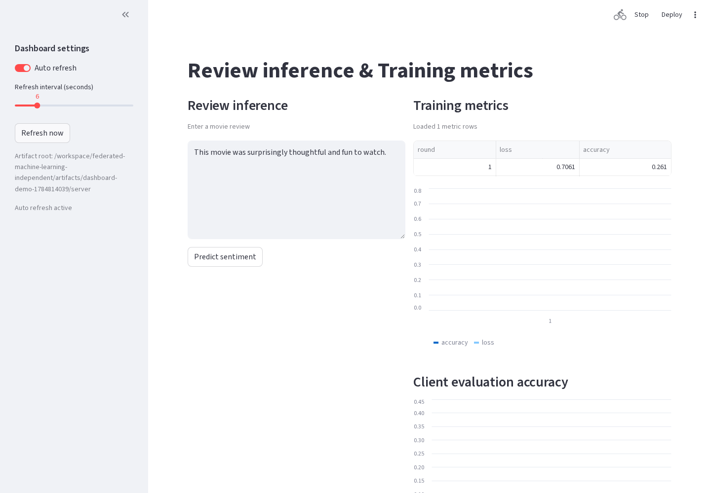
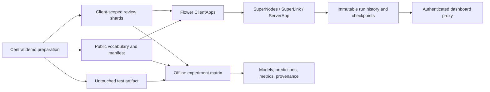

# Federated Sentiment Analysis

[](https://github.com/Linus404/federated-machine-learning/actions/workflows/ci.yml)


[](LICENSE)


A reproducible federated-learning pet project that asks a concrete question:
**how much does client heterogeneity change sentiment-classification quality, and
when do federated or robust aggregation strategies help?**

The repository trains a fixed Keras CNN on the pinned IMDB dataset with local-only,
FedAvg, FedProx, and FedProx plus Huber aggregation. It preserves an untouched test
set, runs real Flower clients, records exact experiment provenance, and ships a
hardened single-host Compose demonstration. It is a portfolio/research system, not
a claim of production privacy.

## Results first

The published compact campaign contains **36 completed cells**: four strategies,
IID plus two Dirichlet non-IID partitions, and three registered seeds. Every cell
ran 20 epochs/rounds against the same checksum-verified test set. Values below are
mean accuracy with sample variance in parentheses; full precision, recall, F1,
ROC-AUC, confusion matrices, timing, communication, and raw per-seed records are in
[`results/portfolio-matrix.json`](results/portfolio-matrix.json).

| Strategy | IID | Dirichlet 0.5 | Dirichlet 0.1 |
| --- | ---: | ---: | ---: |
| Local only | 0.8534 (0.000001) | 0.6724 (0.001691) | 0.5661 (0.006228) |
| **FedAvg** | **0.8876 (0.000001)** | **0.8639 (0.000425)** | **0.7094 (0.014169)** |
| FedProx | 0.8223 (0.000237) | 0.7204 (0.006207) | 0.5702 (0.008122) |
| FedProx + Huber | 0.8225 (0.000022) | 0.7090 (0.011094) | 0.5861 (0.009837) |

### Findings

- **FedAvg won every clean-data partition in this registered configuration.** Its
  IID mean accuracy was 88.76%, versus 85.34% for independent local models.
- **Heterogeneity was the dominant difficulty.** Moving FedAvg from IID to
  Dirichlet 0.1 reduced mean accuracy from 88.76% to 70.94% and materially increased
  seed variance.
- **FedProx was not automatically beneficial.** With the preregistered `mu=0.1`, it
  converged later and underperformed FedAvg. Huber aggregation did not recover that
  gap on clean updates; robust methods are trade-offs, not universal upgrades.
- FedAvg's zero-based mean convergence round moved from 3.0 (IID) to 6.67
  (Dirichlet 0.5) and 12.33 (Dirichlet 0.1).
- Every four-client federated cell moved 1,293,768,960 serialized Flower parameter
  bytes over 20 rounds. The count excludes transport framing, TLS, and control
  messages by definition.

A separate deterministic aggregation microbenchmark covers 4, 16, and 64 simulated
clients. With 25% malicious updates, Huber reduced aggregate L2 error from 71.06 to
4.23 for the outlier transform and from 86.85 to 17.46 for sign flipping on this
synthetic workload. See
[`results/aggregation-benchmark.json`](results/aggregation-benchmark.json) and the
[interpretation limits](docs/PERFORMANCE_AND_ROBUSTNESS.md).

All 36 training cells were produced from clean commit
`e903f196f14f7ffdd7b75e1871de702fd1a24397`, dataset revision
`e6281661ce1c48d982bc483cf8a173c1bbeb5d31`, and protocol checksum
`sha256:75d7b3a77dc43d9216e3c7324f7972fb40866050a9f61885ff1555f6319baaa3`.

## Demo



[Short inference demo](docs/assets/dashboard-demo.gif)

The dashboard loads only checksum-bound completed runs, shows global and per-client
metrics, raises integrity/client-coverage alerts, and performs review inference with
the matching public vocabulary.

## Architecture



The demo preparation step centrally creates all review shards and reads the complete
training split. Client-scoped mounts model a runtime boundary; they do not prove the
data originated at independent organizations. The untouched test artifact is never
mounted into ClientApp, ServerApp, or the dashboard.

### Design choices

| Decision | Rejected alternative | Why |
| --- | --- | --- |
| Frozen executable protocol | Tune after seeing test metrics | Prevent test leakage and irreproducible comparisons |
| One server-held test boundary | Let clients report test scores | Keep final evaluation independent of client training |
| Immutable checksummed run directories | Overwrite `latest` | Preserve history, resume safely, and detect mutation |
| Explicit secure-aggregation deferral | Treat noise/Huber as privacy | Neither hides individual updates |
| Compose as the supported deployment IaC | Invent provider-specific Terraform | No cloud/provider/region/SLO contract exists |

## Quick start

Requirements: Linux, macOS, or WSL 2, Python 3.11–3.13, and
[`uv`](https://docs.astral.sh/uv/). On Windows, use WSL 2 rather than native
PowerShell.

```bash
curl -LsSf https://astral.sh/uv/install.sh | sh
uv sync --frozen
uv run --env-file .env.protocol python -m src.aggregation_benchmark \
  --output artifacts/quickstart-aggregation.json --dimensions 10000 --repeats 2
python -m json.tool artifacts/quickstart-aggregation.json
```

That produces a real 4/16/64-client aggregation and attack result in seconds. For a
real multi-client training round, prepare the pinned dataset and run the opt-in E2E:

```bash
uv run --env-file .env.protocol python -m src.data_prep \
  --client-shard-dir artifacts/portfolio-data/clients \
  --public-artifact-dir artifacts/portfolio-data/public \
  --evaluation-artifact-dir artifacts/portfolio-data/evaluation

RUN_FLOWER_E2E=1 \
FML_E2E_ARTIFACT_ROOT="$(pwd)/artifacts/portfolio-data" \
  uv run --env-file .env.protocol python -m unittest tests.test_flower_e2e
```

## Reproduce the published matrix

The runner is resumable: valid completed cells are reused, while incomplete cell
directories fail rather than being guessed or overwritten.

```bash
uv run --env-file .env.protocol python -m src.experiment_matrix \
  --output-dir artifacts/portfolio-results \
  --strategies local_only fedavg fedprox fedprox_huber \
  --partitions iid_stratified dirichlet_0.5 dirichlet_0.1 \
  --seeds 67 101 211 \
  --client-data-dir 'artifacts/portfolio-data/clients/client-{partition}' \
  --public-artifact-dir artifacts/portfolio-data/public \
  --evaluation-artifact-dir artifacts/portfolio-data/evaluation --quiet
```

The full protocol additionally registers five seeds, median/trimmed-mean strategies,
16/64-client scale cells, and larger robustness/privacy campaigns. The checked-in
portfolio result is deliberately the 36-cell comparison above, not a claim that the
maximum 290-cell research budget was executed.

Each cell writes `results.json`, raw `.npy` predictions, model files, and
`provenance.json` with the Git revision/dirty state, effective configuration,
dataset and protocol identities, seeds, consumed input checksums, and output
checksums.

## Flower and Docker demonstration

Direct local Flower simulation:

```bash
uv run --env-file .env.protocol flwr run . --stream \
  --federation-config "num-supernodes=4"
FML_SERVER_ARTIFACT_DIR=artifacts/server \
  uv run --env-file .env.protocol streamlit run dashboard.py
```

Distributed Compose demonstration:

```bash
FML_PREPARED_ARTIFACT_ROOT=artifacts/portfolio-data/.prepared-current \
  docker compose up --build -d --wait
uv run --env-file .env.protocol python -m src.flower_config
uv run --env-file .env.protocol flwr run . local-docker --stream
```

Open <http://127.0.0.1:8501>, then stop it with `docker compose down --volumes`.
The automated equivalent is:

```bash
FML_PREPARED_ARTIFACT_ROOT=artifacts/portfolio-data/.prepared-current \
  ./scripts/smoke-compose.sh
```

The secure overlay enables TLS on Flower endpoints and authenticates SuperNodes.
The production overlay removes direct dashboard exposure and adds a digest-pinned,
non-root Nginx Basic Auth proxy:

```bash
docker compose --env-file /secure/config/production.env \
  -f compose.yaml -f compose.secure.yaml -f compose.production.yaml \
  up -d --wait --no-build
```

Certificate generation/rotation, password-file creation, environment separation,
centralized single-host log export, canary promotion, rollback, backup, restore,
and teardown are documented in [`OPERATIONS.md`](OPERATIONS.md).

## Capabilities and evidence

- Deterministic, checksum-verified IMDB preparation and an untouched global test set.
- Centralized/local baselines and FedAvg, FedProx, Huber, coordinate median, and
  trimmed-mean aggregation.
- Configurable deployment participation plus strict tensor/client validation and
  non-rejecting MAD-based update anomaly reports.
- Real two-client Flower E2E and four-client container E2E smoke tests.
- Structured JSON logs, health checks, metrics, checkpoints/resume, retention,
  deployment alerts, and release/audit labels.
- TLS, SuperNode identity authentication, dashboard proxy authentication, non-root
  read-only containers, dropped capabilities, resource limits, and pinned images.
- Empirical membership-inference and update-leakage evaluators with exact frozen
  metrics and explicit evidence requirements; see
  [`docs/PRIVACY_EVALUATION.md`](docs/PRIVACY_EVALUATION.md).

## Security, privacy, and limitations

Secure aggregation remains unimplemented by design; see the
[reviewed decision](docs/adr/0001-secure-aggregation.md). The default loopback
Compose profile is intentionally insecure, while `compose.secure.yaml` supplies the
implemented TLS and SuperNode-authenticated path.

Model parameters, updates, metrics, counts, and artifacts may leak information. The
optional update-noise control is an illustrative ablation, not formal differential
privacy: it has no privacy accountant, composition analysis, sensitivity model, or
`epsilon`/`delta` guarantee. Empirical attacks test only their specified candidate
samples and do not prove privacy or absence of leakage.

The supported operational target is a controlled single host. Docker-local log
collection is not immutable off-host compliance storage, Basic Auth should sit
behind TLS for remote access, and no cloud availability/cost/network/IAM contract is
claimed. Use this project for education and controlled research, not decisions about
people or deployment with private client data.

See [`SECURITY.md`](SECURITY.md), [`THREAT_MODEL.md`](THREAT_MODEL.md),
[`MODEL_CARD.md`](MODEL_CARD.md), and [`DATASET_CARD.md`](DATASET_CARD.md).

## Development

```bash
uv run ruff format --check .
uv run ruff check .
uv run mypy
uv run --env-file .env.protocol coverage run -m unittest discover -s tests
uv run --env-file .env.protocol coverage report
docker compose config --quiet
```

CI tests Python 3.11–3.13 on Linux and macOS, measures coverage, validates/builds the
container, and scans dependencies, secrets, and images. Contribution, compatibility,
and vulnerability-reporting policies live in [`CONTRIBUTING.md`](CONTRIBUTING.md),
[`COMPATIBILITY.md`](COMPATIBILITY.md), and [`SECURITY.md`](SECURITY.md).
