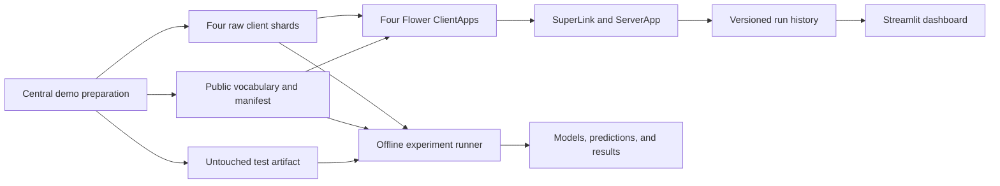

# Federated Sentiment Analysis

[](https://github.com/Linus404/federated-machine-learning/actions/workflows/ci.yml)

A reproducible federated-learning pet project that trains an IMDB sentiment
classifier with Keras, TensorFlow, and Flower. It compares local-only,
centralized, FedAvg, FedProx, and robust aggregation strategies while preserving
an untouched test set and verifiable experiment artifacts.

This project began as a university assignment. Its goal is a credible local
demonstration and a compact scientific comparison.

## Architecture



The preparation command centrally creates all demo shards. Client-scoped
storage models the runtime boundary only; it is not evidence that the data came
from independent organizations. The untouched test artifact is available only
to offline evaluators after training and is not mounted into ClientApp,
ServerApp, or the dashboard.

## Reproduce one experiment

### Requirements

- macOS, Linux, or WSL 2
- [uv](https://docs.astral.sh/uv/)
- Docker with Compose only for the distributed container demonstration

The supported Python versions are 3.11 through 3.13.
On Windows, use WSL 2 rather than native PowerShell.

```bash
curl -LsSf https://astral.sh/uv/install.sh | sh
uv sync --frozen
```

Prepare four client shards, the shared vocabulary, and the untouched evaluation
artifact:

```bash
uv run --env-file .env.protocol python -m src.data_prep \
  --partitions 4 \
  --client-shard-dir artifacts/clients \
  --public-artifact-dir artifacts/public \
  --evaluation-artifact-dir artifacts/evaluation
```

Run one registered FedAvg cell:

```bash
uv run --env-file .env.protocol python -m src.strategy_runner fedavg \
  --output-dir artifacts/strategies/fedavg
```

Each output directory must be new. The run writes:

- `results.json` with the effective configuration and canonical metrics;
- one `.npy` file for every ordered validation and test prediction vector;
- the final `.keras` model.

Inspect the result with:

```bash
python -m json.tool artifacts/strategies/fedavg/results.json
```

## Experiment commands

### Baselines

```bash
uv run --env-file .env.protocol python -m src.baseline_training centralized \
  --output-dir artifacts/baselines/centralized

uv run --env-file .env.protocol python -m src.baseline_training local-only \
  --output-dir artifacts/baselines/local-only
```

The centralized baseline trains on the union of the registered fitted rows. The
local-only baseline trains one model per client and reports their unweighted
mean. Both evaluate on the untouched test artifact only after training.

### Federated and robust strategies

```bash
uv run --env-file .env.protocol python -m src.strategy_runner STRATEGY \
  --output-dir OUTPUT_DIRECTORY
```

| Strategy | Meaning |
| --- | --- |
| `local_only` | One independent model per client |
| `fedavg` | Sample-weighted federated averaging |
| `fedprox` | FedAvg with the registered proximal objective |
| `fedprox_huber` | FedProx with multidimensional Huber aggregation |
| `fedmedian` | Coordinate-wise median aggregation |
| `fedtrimmedavg` | Coordinate-wise trimmed-mean aggregation |

The current runner executes one four-client `iid_stratified` cell for one of the
registered seeds `67`, `101`, `211`, `307`, or `401`. It performs 20 epochs or
rounds with batch size 64 and evaluates the fixed validation rows through the
canonical evaluator after every epoch or round.

The canonical evaluator reports accuracy, precision, recall, F1, ROC-AUC, and
the confusion matrix. It also preserves the exact float32 probabilities used to
derive those metrics.

### Single-client training

```bash
uv run --env-file .env.protocol python -m src.local_training \
  --client-data-dir artifacts/clients/client-0 \
  --public-artifact-dir artifacts/public \
  --run-artifact-dir artifacts/local-runs
```

Each invocation creates a new immutable `runs/<run_id>` directory beneath the
history root.

## Run the Flower demonstration

### Direct local simulation

After preparing the artifacts, run:

```bash
uv run --env-file .env.protocol flwr run . --stream \
  --federation-config "num-supernodes=4"
```

Start the dashboard against the selected server run:

```bash
FML_SERVER_ARTIFACT_DIR=artifacts/server \
  uv run --env-file .env.protocol streamlit run dashboard.py
```

### Distributed local Docker runtime

The Compose stack runs one SuperLink, one ServerApp, four
SuperNode/ClientApp pairs, and the dashboard:

```bash
FML_CODE_REVISION="$(git rev-parse HEAD)" docker compose up --build -d
uv run --env-file .env.protocol python -m src.flower_config
uv run --env-file .env.protocol flwr run . local-docker --stream
```

Open <http://127.0.0.1:8501>, then stop the stack with:

```bash
docker compose down
```

Each ClientApp receives only its matching raw shard as a read-only mount. Public
artifacts are read-only, only ServerApp can write the server history, and the
untouched evaluation artifact is not mounted into the runtime.

The `local-docker` Flower profile uses insecure loopback transport. It must not
be used for a remote or public SuperLink.

## Reproducibility and artifacts

The frozen contract lives in
[`docs/scientific-protocol-v1.toml`](docs/scientific-protocol-v1.toml). It pins
the dataset revision, split checksums, model settings, seeds, partition rules,
training order, strategy parameters, metrics, and statistical rules.

Every documented Python entry point uses `.env.protocol` so the hash seed,
TensorFlow determinism flags, and Keras backend are set before Python starts.
Missing or conflicting values fail immediately.

Server runs are stored under `artifacts/server/runs/<run_id>`. A run becomes
current only after its model, metrics, provenance, and SHA-256 artifact manifest
have been finalized. Existing runs remain available for comparison, and
retention never removes the active or selected run.

See [`COMPATIBILITY.md`](COMPATIBILITY.md) for schema compatibility and
regeneration rules.

## Security and privacy limitations

This repository does not implement TLS, client or SuperNode authentication,
secure aggregation, formal differential privacy, or dashboard authentication.

Model parameters, metrics, sample counts, and saved artifacts may leak
information about client data. The optional update-noise setting is an
illustrative ablation, not formal differential privacy. It has no privacy
accountant, composition analysis, sensitivity model, or epsilon/delta guarantee.

The supported deployment target is local execution. Cloud deployment,
monitoring, disaster recovery, canary releases, and other production operations
are intentionally outside the pet-project finish line.

See [`THREAT_MODEL.md`](THREAT_MODEL.md),
[`SECURITY.md`](SECURITY.md), and the
[secure-aggregation decision](docs/adr/0001-secure-aggregation.md) for the
detailed boundaries.

## Development

Run the same local quality gates used by CI:

```bash
uv sync --frozen
uv run ruff format --check .
uv run ruff check .
uv run mypy
uv run --env-file .env.protocol coverage run -m unittest discover -s tests
uv run --env-file .env.protocol coverage report
docker compose config --quiet
```

CI validates Python 3.11, 3.12, and 3.13, scans dependencies and containers, and
builds and smoke-tests the application image.

See [`CONTRIBUTING.md`](CONTRIBUTING.md) before opening a change.

## Technology

- [Flower](https://flower.ai/) for federated orchestration
- [Keras](https://keras.io/) and
  [TensorFlow](https://www.tensorflow.org/) for model training
- [Hugging Face Datasets](https://huggingface.co/docs/datasets/) for the pinned
  IMDB dataset
- [Streamlit](https://streamlit.io/) for the local dashboard
- NumPy for deterministic artifacts and metric inputs
